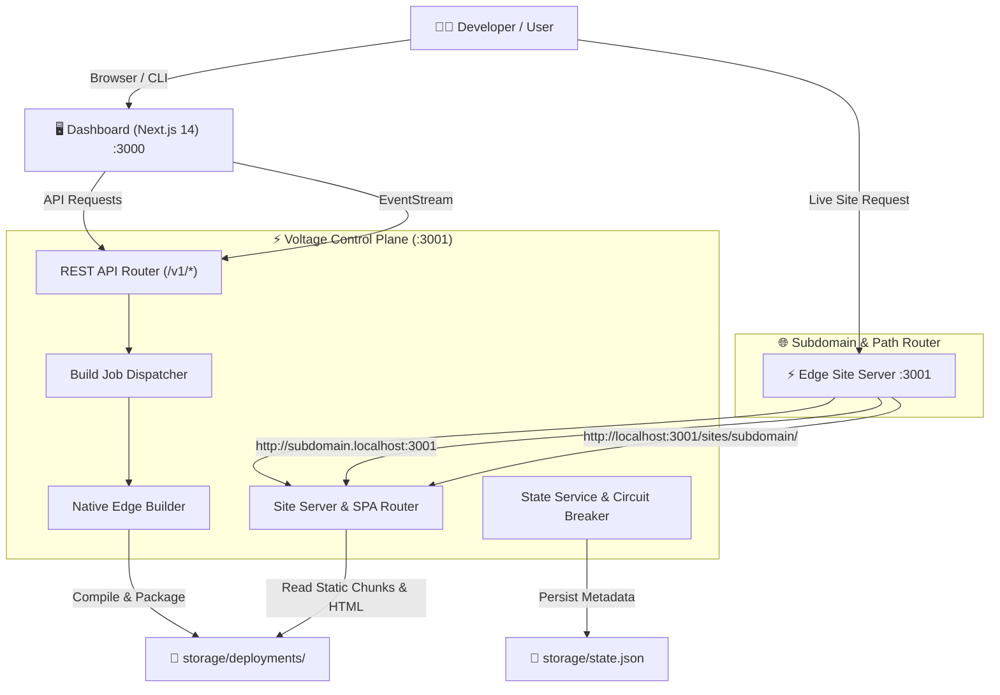

# ⚡ Voltage — Modern Edge Deployment Platform

[](https://www.typescriptlang.org/)
[](https://nextjs.org/)
[](https://expressjs.com/)
[](https://tailwindcss.com/)
[](https://openresty.org/)
[](LICENSE)

> **Voltage** is a developer-first cloud deployment platform — inspired by Vercel and Render — that transforms any Git repository into a live, globally routed edge deployment with zero configuration.

---

## 🌟 Highlights

- **🚀 Native Edge Builder Engine**: Zero-Docker lightweight builder capable of shallow cloning repositories, detecting frameworks, auto-resolving monorepos (`packages/frontend`, `client`, etc.), running package installations, and packaging output artifacts.
- **🌐 Real Dynamic Subdomain Routing**: Immediate resolution via `http://<subdomain>.localhost:3001` (modern browsers natively resolve `*.localhost` to `127.0.0.1`) and universal direct path URLs (`http://localhost:3001/sites/<subdomain>/`).
- **📟 Live Real-Time SSE Log Streaming**: Server-Sent Events (SSE) pipe compilation stdout and stderr directly into the dashboard terminal in real time.
- **🛡️ AES-256-GCM Secrets Encryption**: Zero-knowledge encryption for production environment variables with authenticated ciphertext verification.
- **🔌 Automatic Framework Detection**: First-class zero-config support for **Next.js** (App Router & Pages Router), **Vite**, **React**, static SPAs, and monorepos.
- **💾 Resilient Circuit-Breaker Persistence**: Built-in fault tolerance with instant fallback to local disk storage (`storage/state.json`) when external databases or Redis clusters are offline during local development.
- **📊 Developer Dashboard**: Dark-mode cinematic interface featuring real-time build stage indicators, interactive live preview windows, domain management, and instantaneous rollbacks.

---

## 🏗️ System Architecture



---

## 📦 Monorepo Structure

```
voltage/
├── control-plane/          # Express API server, state management, & native build pipeline
│   ├── prisma/             # Relational data models (PostgreSQL)
│   ├── src/
│   │   ├── middleware/     # Auth & token validation
│   │   ├── routes/         # REST endpoints (/v1/projects, /v1/deployments, etc.)
│   │   └── services/       # Native builder, site server, encryption, & state engine
│   └── tsconfig.json
├── dashboard/              # Next.js 14 developer console & telemetry previewer
│   ├── src/
│   │   ├── app/            # App router pages, project views, and live preview window
│   │   ├── components/     # UI primitives, LiveTerminal, & layout components
│   │   └── hooks/          # SSE streaming hooks & data fetchers
│   └── tailwind.config.ts
├── packages/
│   └── shared-types/       # Canonical TypeScript interfaces for projects & deployments
├── reverse-proxy/          # OpenResty & Nginx routing scripts for edge clusters
├── builder-image/          # Dockerfile sandbox image for containerized build environments
├── storage/                # Local build workspaces & persistent deployment bundles
├── docker-compose.yml      # Local services orchestration (Postgres, Redis, MinIO)
└── DEPLOYMENT.md           # Production deployment & infrastructure guide
```

---

## 🚀 Quickstart

### Prerequisites
- **Node.js**: `v20.0.0` or higher
- **npm**: `v10.0.0` or higher
- **Git**

### 1. Clone & Install Dependencies
```bash
git clone https://github.com/Rishabh028/Voltage.git
cd Voltage
npm install
```

### 2. Configure Environment
Copy the example environment configuration:
```bash
cp .env.example .env
```

### 3. Run the Development Platform
Run both the Control Plane backend and Dashboard frontend concurrently:

```bash
# Terminal 1: Start the Control Plane (Port 3001)
cd control-plane
npm run dev

# Terminal 2: Start the Developer Dashboard (Port 3000)
cd dashboard
npm run dev
```

Visit the dashboard at **[http://localhost:3000](http://localhost:3000)**.

---

## 🌐 Edge Routing & Live Previews

Voltage delivers authentic live edge routing for every build:

| Access Method | URL Pattern | Description |
|---|---|---|
| **Subdomain Routing** | `http://<subdomain>.localhost:3001` | Authentic Vercel-style preview URL. Chrome, Edge, and Firefox resolve `*.localhost` natively to `127.0.0.1`. |
| **Direct Path Routing** | `http://localhost:3001/sites/<subdomain>/` | Universal routing path compatible with all local network setups and iframe embedding. |
| **Dashboard Live Preview** | `http://localhost:3000/preview/<subdomain>` | Interactive live site preview with simulated latency telemetry and client state testing. |

---

## 💻 Programmatic API Usage

Voltage exposes a clean V1 REST API:

### Create Project
```bash
curl -X POST http://localhost:3001/v1/projects \
  -H "Authorization: Bearer dev-token" \
  -H "Content-Type: application/json" \
  -d '{
    "name": "my-app",
    "gitUrl": "https://github.com/vercel/next.js"
  }'
```

### Trigger Deployment
```bash
curl -X POST http://localhost:3001/v1/deployments \
  -H "Authorization: Bearer dev-token" \
  -H "Content-Type: application/json" \
  -d '{
    "projectId": "<PROJECT_ID>",
    "branch": "main"
  }'
```

### Stream Real-Time Build Logs (SSE)
```bash
curl -N http://localhost:3001/v1/deployments/<DEPLOYMENT_ID>/events \
  -H "Authorization: Bearer dev-token"
```

---

## 🧪 Testing

Run test suites across workspaces using Vitest:

```bash
# Run control-plane integration tests
cd control-plane
npm test

# Run all workspace typechecks
npm run typecheck
```

---

## 📄 License

This project is licensed under the [MIT License](LICENSE).
